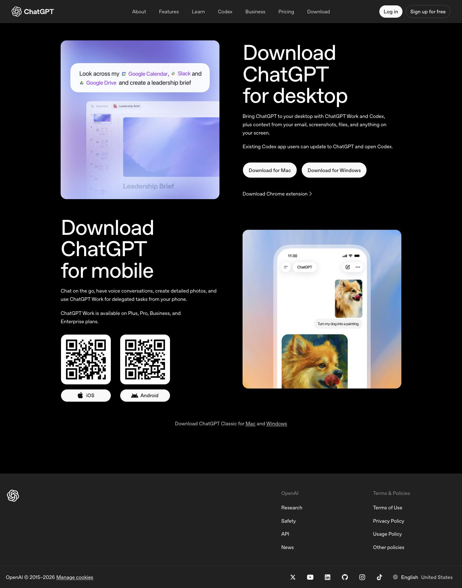
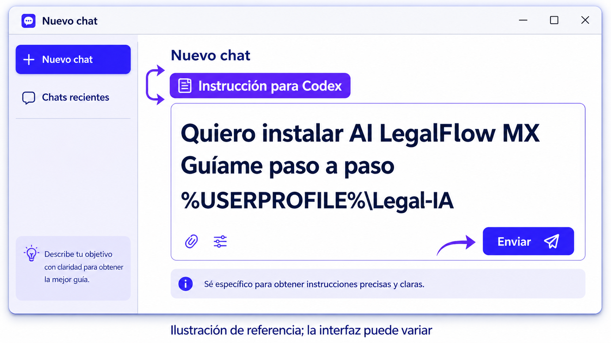
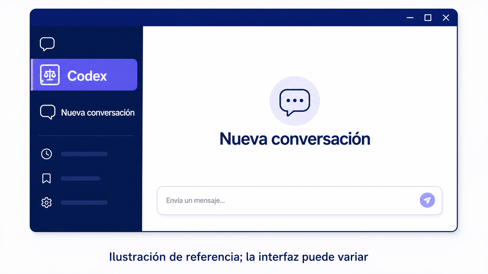
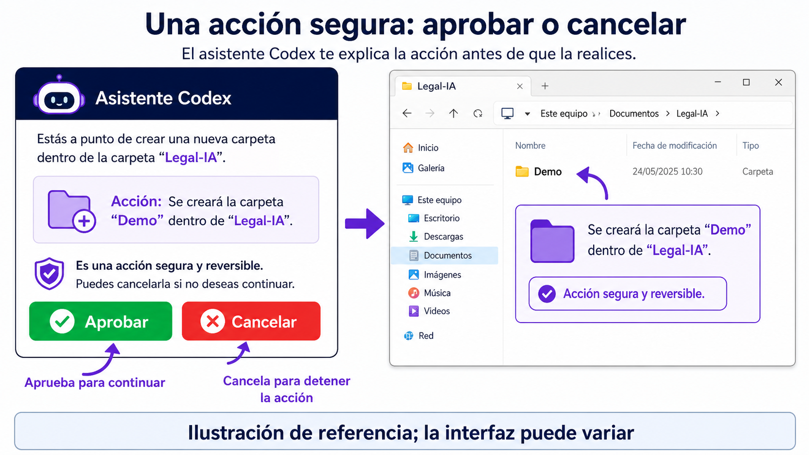
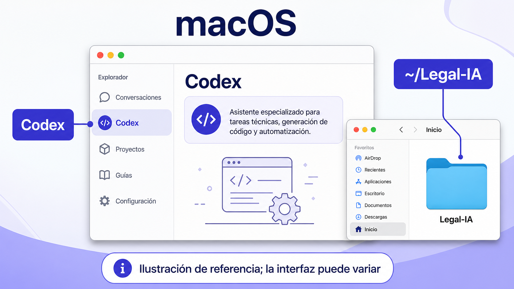

# 3. Empieza en tres pasos en Windows

Primero descarga [ChatGPT para Windows](https://chatgpt.com/download). Después abre Codex y pega esta instrucción en una conversación nueva:



*Captura real de `chatgpt.com/download`, 15 de agosto de 2026. La interfaz puede cambiar; usa siempre el enlace oficial.*

```text
Quiero instalar AI LegalFlow MX en esta computadora Windows.
Guíame paso a paso. Revisa primero mi equipo. Después instala AI LegalFlow MX
con el método oficial, crea mi carpeta de asuntos en %USERPROFILE%\Legal-IA y
ayúdame a ejecutar una demostración o crear mi primer asunto.

No me pidas ni guardes contraseñas, tokens, códigos de verificación ni
información de clientes. Antes de descargar, instalar, crear carpetas o
configurar nube, explícame qué harás y pide mi aprobación.
```



*Pega la instrucción completa y envíala. Ilustración de referencia; la interfaz puede variar.*



*Ilustración de referencia; la interfaz puede variar.*

Codex debe mostrar su plan antes de actuar. Aprueba sólo las acciones que entiendas. Tu carpeta de asuntos queda en `%USERPROFILE%\Legal-IA`; el inicio es local y no requiere GitHub. En macOS la misma secuencia usa `~/Legal-IA`.



*Aprueba sólo acciones claras y crea una Demo local. Ilustración de referencia; la interfaz puede variar.*

## macOS: sigue estos pasos

En macOS abre ChatGPT, elige Codex y pega la misma instrucción. Tu carpeta sugerida es `~/Legal-IA`; el modo inicial también es local.



*Ilustración de referencia; la interfaz puede variar.*

# 4. Instalación de un comando y diagnóstico

El punto de entrada compatible es `curl -fsSL https://raw.githubusercontent.com/hassanvfx/legalflow-mx/main/install.sh | bash`. El instalador descarga una release versionada, espera un checksum y no debe continuar si su verificación falla. El nombre público es AI LegalFlow MX; el comando `legalflow`, el paquete y la URL permanecen por compatibilidad.

Después de instalar, ejecuta `legalflow setup` o `legalflow doctor`. La salida humana identifica cada requisito como LISTO, ATENCIÓN REQUERIDA, OPCIONAL o BLOQUEADO. Cada resultado explica por qué importa, qué hacer, la guía viva, la alternativa segura y el comando `legalflow setup --resume`.

La salida `--json` está pensada para automatización y deliberadamente no mezcla créditos ni texto de marketing. El estado reanudable se guarda localmente y no debe contener passwords, tokens, códigos MFA ni passkeys.

# 5. Codex, Git, GitHub y modo local-only

Codex es la superficie oficial prevista para el flujo guiado. Si falta, el diagnóstico explica cómo instalarlo y conserva la instalación del CLI y de la plantilla. No copies credenciales a la terminal compartida, al chat ni a un archivo del matter. La autenticación, navegador y 2FA deben completarse directamente con GitHub cuando se habilite en una versión compatible.

Para conocer el flujo sin usar información real, ejecuta `legalflow onboard` para ver el plan y `legalflow onboard --confirm --demo` para aprobar una Demo local. Crea un asunto llamado Demo con una notificación sintética, un hecho y un evento respaldados, una vista de revisión y el punto seguro `ok/001-demo`. No necesita GitHub ni datos de cliente; úsalo antes de crear un asunto real.

Git y GitHub CLI se muestran como requisitos separados. Git mantiene historia; `gh` sólo será necesario para sincronización privada. Si GitHub, red, proxy o cuenta no están listos, el fallback es trabajar localmente. Local-only no es un error: es la ruta segura mientras la sincronización no haya sido aprobada y verificada.

Nunca concedas permisos de administrador sólo para continuar un setup. Elige una carpeta escribible, resuelve el requisito indicado y reanuda. Si una descarga se corrompe, no la ejecutes: repite el bootstrap para obtener el archivo y checksum correctos.
